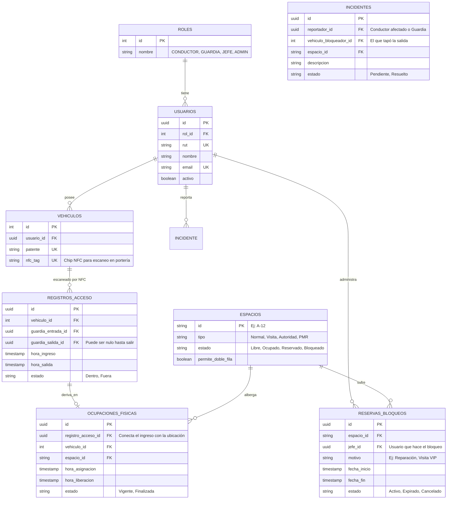

# Vista Lógica de Base de Datos y Prompts para Figma (V2 Integrada)
**Proyecto:** Sistema Inteligente de Gestión de Estacionamientos
**Objetivo:** Reflejar la conexión exacta y detallada entre las tablas de la base de datos (Supabase) y los 4 servicios de la arquitectura, para garantizar que los diseños de Figma tengan sustento técnico.

---

## 1. Vista Lógica de la Base de Datos (Modelo Altamente Conectado)

Hemos separado los conceptos de "Ingreso al recinto" (controlado por el guardia) y "Ocupación física del cajón" (confirmado por el conductor) para mantener métricas exactas.

### Relación Directa de la BD con los 4 Servicios:
1. **App Conductor:** El conductor lee `ESPACIOS`, crea/edita su `OCUPACIONES_FISICAS` asociando su `VEHICULO`, y crea un `INCIDENTE` si su auto es bloqueado.
2. **App Guardia:** Escanea el `nfc_tag` para insertar un `REGISTRO_ACCESO`. Luego lee `OCUPACIONES_FISICAS` vs `ESPACIOS` para hacer sus rondas. Lee y atiende los `INCIDENTES`.
3. **Panel Jefatura:** Analiza `REGISTROS_ACCESO` (Rotación) y crea `RESERVAS_BLOQUEOS` modificando el estado de los `ESPACIOS`.
4. **Vista Super Admin:** Tiene CRUD (Crear, Leer, Actualizar, Borrar) sobre `USUARIOS`, `ROLES` y `VEHICULOS`.

---

## 2. Prompts de Figma AI (Altamente Conectados a la BD)

Estos prompts (en inglés) instruyen a la IA de Figma para que las pantallas tengan exactamente los campos y funciones que hemos modelado en la Base de Datos.

### 📱 1. App Conductor (Frontend Móvil)
> **Prompt para Figma AI / Musho / Uizard:**
> *"Design a minimalist mobile app interface for a university smart parking system. The user is a driver (Student/Teacher). The top header must show 'Welcome [Driver Name]' and their 'License Plate' (fetched from USUARIOS and VEHICULOS DB). The main body features an interactive 2D map of the parking lot with spots marked as 'A-12' (from ESPACIOS DB). Free spots are green, occupied are grey, reserved are red. Below the map, include a large primary button labeled 'Confirm My Spot'. Add a floating action button (FAB) at the bottom right with a warning icon to 'Report Blocked Car' (links to INCIDENTES DB). Use a clean white background, modern sans-serif typography, rounded corners, and primary blue/green accents."*

### 📱 2. App Guardia (Frontend Tablet/Móvil)
> **Prompt para Figma AI / Musho / Uizard:**
> *"Design a tablet interface for a parking security guard working outdoors. The UI must use a high-contrast 'Dark Mode' (black background with bright neon accents) for high visibility. Split the screen into two vertical columns (70% left, 30% right). Left column: A live interactive map of the parking lot (from ESPACIOS DB). Right column top: Huge metrics titled 'Live Access' showing 'Total Entries' and 'Current Capacity' (from REGISTROS_ACCESO DB). Right column middle: A massive, highly tappable button saying 'SCAN NFC / QR ENTRY'. Right column bottom: A scrollable feed of 'Active Incidents' showing blocked cars and license plates (from INCIDENTES DB). Ensure buttons are large and typography is bold."*

### 💻 3. Panel Jefatura / Servicios Generales (Frontend Web)
> **Prompt para Figma AI / Musho / Uizard:**
> *"Design a modern corporate SaaS web dashboard for a university facilities chief managing parking operations. Include a sleek left sidebar navigation. The main content area top row must display 3 KPI summary cards: 'Occupancy Rate', 'Peak Entry Times', and 'Active Blocks' (calculated from REGISTROS_ACCESO DB). Below the KPIs, split the layout: The left side shows a wide line-chart of weekly parking usage. The right side features a clean data table titled 'Manage Reservations & Blocks' (from RESERVAS_BLOQUEOS DB). The table columns are: Spot ID, Reason (e.g. VIP Visit, Maintenance), Start Date, and an 'Action' column with a toggle switch to 'Block/Unblock'. Use an enterprise aesthetic: light grey background, crisp white cards, subtle drop-shadows, and navy blue primary branding."*

### 💻 4. Vista Super Admin (Frontend Web)
> **Prompt para Figma AI / Musho / Uizard:**
> *"Design a desktop web admin console for managing system access in a smart parking platform. The aesthetic should be highly technical, dense, and functional, resembling the AWS or Vercel dashboard. The main view is a robust, full-width data grid (table) titled 'User & Vehicle Directory' (from USUARIOS and VEHICULOS DB). Table columns: Name, Email, Role (using colorful pill badges for Conductor, Guard, Admin), License Plate, and NFC Tag ID. Above the table, include a powerful search bar, advanced filter dropdowns, and a primary button '+ Enroll User/Vehicle'. On the right edge of the screen, include a slide-out drawer (modal) that opens when a user is clicked, displaying a form to edit their Role assignments and link NFC tags. Use a very clean, monochrome color palette with blue action buttons."*
