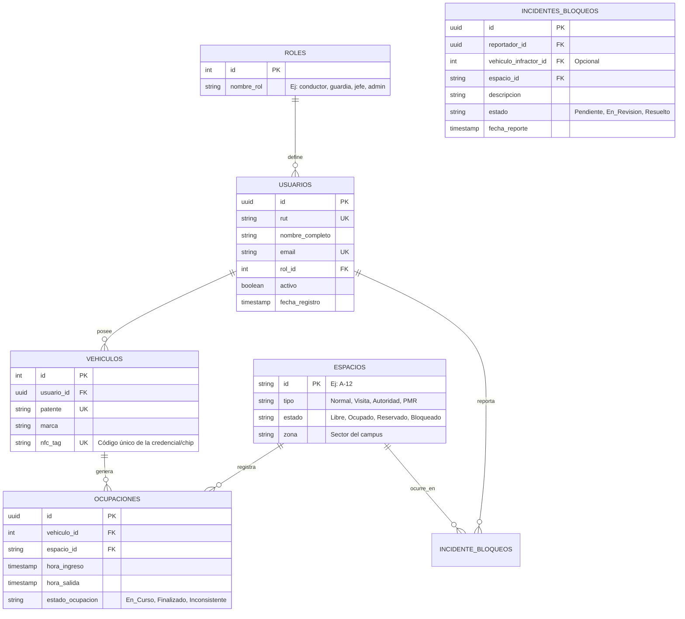

# Vista Lógica de Base de Datos y Prompts para Figma
**Proyecto:** Sistema Inteligente de Gestión de Estacionamientos

---

## 1. Vista Lógica de la Base de Datos (Supabase / PostgreSQL)

La vista lógica define las entidades principales, sus atributos y cómo se relacionan entre sí para soportar todo el ecosistema (accesos, ocupaciones, bloqueos y usuarios).

### Reglas de Negocio a nivel de BD:
* **Row-Level Security (RLS):** Un `Conductor` solo puede ver sus propios `Vehiculos` y `Ocupaciones`. Un `Guardia` o `Jefe` puede leer toda la tabla de `Ocupaciones`.
* **Restricción Única:** Un `Vehiculo` no puede tener dos `OCUPACIONES` con estado `En_Curso` simultáneamente.
* **Restricción Única:** Un `Espacio` no puede tener más de una ocupación física activa, excepto si el tipo de espacio permite "doble fila".

---

## 2. Prompts de Diseño UI/UX para Figma (IA)

Si vas a utilizar herramientas de Inteligencia Artificial para diseño (como Figma AI, Musho, Uizard o Galileo AI), copia y pega los siguientes prompts. Están optimizados en inglés (ya que las IAs de diseño suelen entender mejor los estilos en este idioma), pero detallan exactamente los 4 servicios.

### 📱 1. App Conductor (Frontend Móvil)
**Prompt para Figma:**
> *"Design a modern mobile app interface for a smart university parking system. The main screen must feature an interactive 2D/3D map of the parking lot showing available spaces in green and occupied spaces in gray. Below the map, include a large primary button that says 'Confirm Parking Spot'. Add a top navigation bar showing the user's profile picture and their vehicle's license plate. Include a floating action button (FAB) in the corner with a warning icon to 'Report Blocked Car'. The aesthetic should be clean, minimalist, high contrast, using a white background with primary blue and green accents. Use rounded corners and soft shadows for a modern iOS/Android look."*

### 📱 2. App Guardia (Frontend Tablet/Móvil)
**Prompt para Figma:**
> *"Design a tablet interface for a parking lot security guard. The dashboard needs to be highly visible outdoors, so use a high-contrast 'Dark Mode' theme with neon accents. The layout should have two columns. The left column (70% width) displays a live interactive map of the parking lot highlighting empty and occupied spots. The right column (30% width) must show 'Live Capacity Counters' (Total Entries, Exits, Available spots in large typography). Include a prominent, massive button labeled 'SCAN NFC / QR ENTRY'. At the bottom of the right column, include a feed of recent alerts or blocked vehicles. The design must feel industrial, technical, and extremely easy to tap."*

### 💻 3. Panel Jefatura / Servicios Generales (Frontend Web)
**Prompt para Figma:**
> *"Design a modern corporate SaaS web dashboard for a university facilities administrator managing a parking lot. The layout should have a left sidebar navigation. The main content area must feature a top row with 3 KPI cards: 'Current Occupancy Rate', 'Peak Hours', and 'Active Incidents'. Below the KPIs, include a large area chart showing the parking lot usage over the week. To the right, include a clean data table titled 'Reserved Spaces' showing Spot ID, Reason, and a toggle switch to 'Block' or 'Release' the spot. The style should be enterprise-grade, clean, professional, using a light grey background with white cards, subtle borders, and a primary brand color of navy blue."*

### 💻 4. Vista Super Admin (Frontend Web)
**Prompt para Figma:**
> *"Design a desktop web admin panel for managing users and vehicles in a smart parking system. The interface needs a large, detailed data table showing a list of registered users with columns for Name, Role (badge tags), License Plate, and Status (Active/Inactive). Above the table, include a robust search bar, dropdown filters, and a primary button to '+ Enroll New User'. On the right side of the screen, include a slide-out modal (drawer) that opens when clicking a user, showing form fields to edit their permissions and assign NFC tags. The aesthetic should be minimalistic, technical, data-heavy, and highly functional, similar to AWS or Vercel dashboard designs."*
