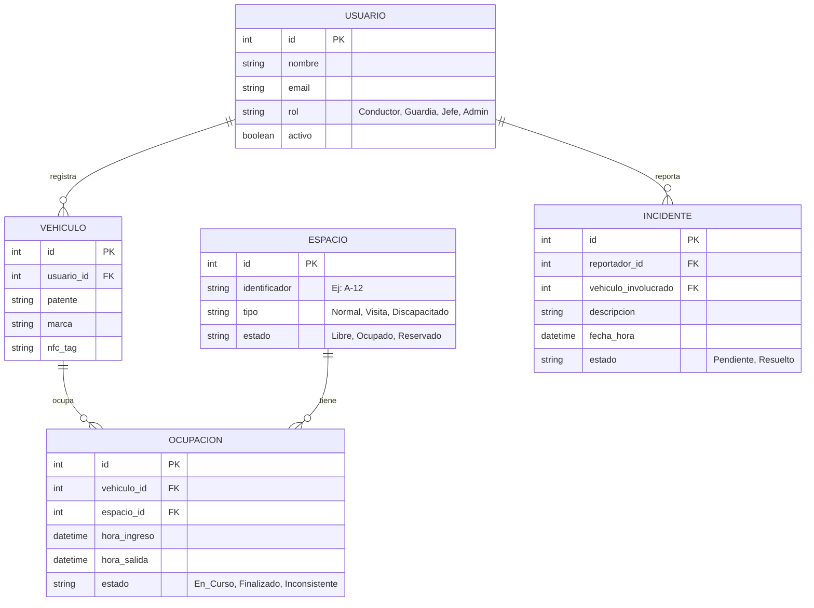

# Modelos UML y Prompts
**Proyecto:** Sistema Inteligente de Gestión de Estacionamientos

A continuación, presento el código **Mermaid** para generar los Diagramas UML automáticamente, además de los **Prompts** en caso de que necesites generarlos en una herramienta externa (como ChatGPT, Claude o PlantUML).

## 1. Diagrama de Casos de Uso (UML)
Este diagrama muestra las interacciones de los 4 actores principales con los 4 servicios del sistema.

```mermaid
left to right direction
actor Conductor
actor Guardia
actor "Jefe de Servicios" as Jefe
actor "Super Admin" as Admin

package "Sistema de Gestión de Estacionamientos" {
  
  %% App Conductor
  usecase "Visualizar Mapa y Ocupación" as UC1
  usecase "Confirmar Ubicación de Estacionamiento" as UC2
  usecase "Reportar Incidente o Bloqueo" as UC3

  %% App Guardia
  usecase "Escanear NFC/QR (Contador Ingreso/Salida)" as UC4
  usecase "Recibir Sugerencia de Asignación" as UC5
  usecase "Supervisar Rondas (Verificar Patente)" as UC6

  %% Panel Jefatura
  usecase "Bloquear Espacios / Gestionar Reservas" as UC7
  usecase "Visualizar Reportes y Estadísticas" as UC8

  %% Panel Super Admin
  usecase "Enrolar Vehículos y Conductores" as UC9
  usecase "Gestionar Cuentas y Roles" as UC10
}

Conductor --> UC1
Conductor --> UC2
Conductor --> UC3

Guardia --> UC4
Guardia --> UC5
Guardia --> UC6

Jefe --> UC7
Jefe --> UC8

Admin --> UC9
Admin --> UC10
```

### 💬 Prompt para generar este Caso de Uso en otra IA:
> **Copia y pega lo siguiente:**
> *"Actúa como un Arquitecto de Software experto en UML. Créame el código para un 'Diagrama de Casos de Uso' usando la sintaxis de PlantUML o Mermaid. El sistema se llama 'Sistema Inteligente de Gestión de Estacionamientos'. Los actores son 4: Conductor, Guardia, Jefe de Servicios y Super Admin. Los casos de uso son: Para el Conductor (Visualizar mapa, Confirmar ubicación, Reportar bloqueo). Para el Guardia (Escanear NFC ingreso/salida, Recibir sugerencia de asignación de espacio, Supervisar rondas verificando patentes). Para el Jefe de Servicios (Bloquear espacios para reservas, Visualizar reportes). Para el Super Admin (Enrolar vehículos, Gestionar roles)."*

---

## 2. Modelo de Base de Datos (Diagrama Entidad-Relación UML)
Este es el esquema inicial de cómo se relacionarán los datos en Supabase.



### 💬 Prompt para generar este Diagrama de Base de Datos en otra IA:
> **Copia y pega lo siguiente:**
> *"Actúa como un Diseñador de Bases de Datos. Genérame el código Mermaid para un Diagrama Entidad-Relación (ER Diagram) de un Sistema de Estacionamientos. Necesito las siguientes tablas: USUARIO (id, nombre, email, rol), VEHICULO (id, usuario_id, patente, nfc_tag), ESPACIO (id, identificador, tipo, estado), OCUPACION (id, vehiculo_id, espacio_id, hora_ingreso, hora_salida, estado) e INCIDENTE (id, reportador_id, vehiculo_involucrado, descripcion). Define las relaciones 1 a N de forma clara (Ej. Un usuario tiene varios vehículos, un vehículo tiene varias ocupaciones)."*
