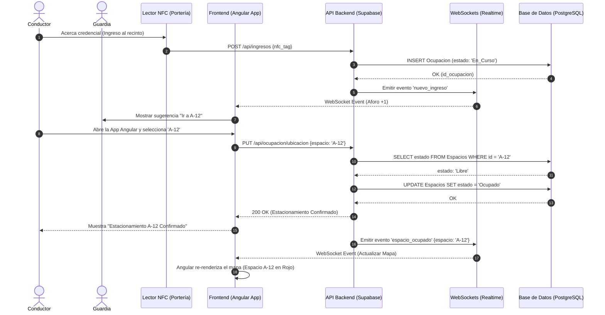

# Diagrama de Secuencia (UML)
**Proyecto:** Sistema Inteligente de Gestión de Estacionamientos
**Arquitectura:** Frontend Angular + Backend (Supabase/API)

El siguiente diagrama de secuencia en **Mermaid.js** ilustra el flujo de comunicación y la estructura completa de un servicio principal: **El ingreso mediante NFC y la confirmación de la ubicación**, demostrando cómo interactúa el Frontend en Angular con el Backend y la Base de Datos.

## Código Mermaid.js

### 💬 Prompt para generar este Diagrama de Secuencia en otra IA:
> **Copia y pega lo siguiente:**
> *"Actúa como Arquitecto de Software. Créame un Diagrama de Secuencia UML usando Mermaid.js. El flujo debe mostrar cómo un Frontend desarrollado en Angular interactúa con un Backend (API) y una Base de Datos en un sistema de estacionamientos. Participantes: Conductor, Guardia, Sensor NFC, Frontend Angular, API Backend, WebSockets (Realtime) y Base de Datos (PostgreSQL). El flujo debe ser: 1. El conductor acerca el NFC al sensor. 2. El sensor notifica a la API. 3. La API guarda en BD. 4. La API notifica por WebSocket al Frontend del guardia que el aforo subió. 5. El Conductor en su App Angular selecciona el estacionamiento A-12. 6. El Frontend Angular envía la petición a la API. 7. La API valida en BD que esté libre. 8. La API actualiza la BD y responde OK al Angular. 9. La API emite un evento WebSocket a todos los frontends Angular para pintar el mapa de color rojo en ese espacio."*
